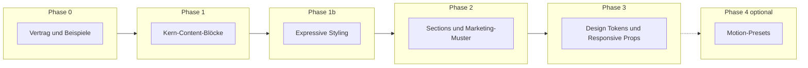

# Roadmap: Landing Page Fähigkeit & Agent-Interop

## 1. Ziel

**OpenFrame** soll aus Agenten-Workflows heraus **überzeugende, moderne Landing Pages** im **Canonical Document** (`OpenframePageDocument`) erzeugen und im **Editor** weiterbearbeitbar halten — ohne die Vision aus `docs/01_Concept.md` zu sprengen: **SSOT**, **validierbar**, **Renderer + Editor** teilen sich dieselbe Quelle.

Diese Roadmap priorisiert **Block-Typen und Props**, die typische Marketing-Sites abdecken, und benennt **Querschnittsaufgaben** (Schema, Beispiele, Tests).

## 2. Leitplanken

| Prinzip | Konsequenz |
| ------- | ---------- |
| Daten im Baum | Neue Fähigkeiten primär über **`PageNode.type` + `props`** (und wo nötig **`PageNode`-Felder**), nicht über lose Tailwind-Strings ohne Grenzen. |
| Editor-Parität | Jede neue Renderer-Komponente braucht **Properties im Editor** oder eine bewusste Ausnahme („read-only / derived“). |
| Agent-Vertrag | Erweiterungen im **`openframe/examples/`** und optional **`openframe.schema.json`** dokumentieren; Tests mit **`parsePageDocument`**. |
| Motion isoliert | Scroll/Timeline/WebGL bleiben nach **`DraftPreview` / Concept** getrennt vom Editor-Chrome; Presets statt beliebiges Skript im Panel. |

## 3. Ausgangslage (kurz)

- **Blöcke:** `container`, `frame`, `text`, `heading`, `link`, `button`, `image` — siehe `blockRegistry` in `src/lib/preview/block-components.tsx`.
- **Frame:** Layout (Flex/Grid), Spacing, Alignment, Position (flow/absolute), Overflow, z-index, Breite hug/fill — siehe `frame-block.tsx`.
- **Gestalterische Tiefe:** noch begrenzt (Phase **1b** adressiert Farben, Viewport-Maße, Pointer & Co.).

## 4. Phasenüberblick

**Reihenfolge:** Phase **1b** liegt **nach** inhaltlichen Kern-Blöcken (Phase 1) und **vor** strukturellen Marketing-Bausteinen (Phase 2), damit bestehende Blöcke (v. a. **`frame`**, Text, Button, Bild) zuerst gestalterisch und interaktiv konkurrenzfähig werden; Phase 2 baut darauf auf.

## 5. Phase 0 — Fundament (Agenten & Qualität)

**Status: umgesetzt** (Allowlist-Modul, Golden JSON, JSON Schema, Parser-/Renderer-Tests, Doku).

**Ziel:** Externe Agenten wissen exakt, was erlaubt ist; CI schützt das Format.

| # | Lieferung | Nutzen |
| - | --------- | ------ |
| 0.1 | **Allowlist** der Block-`type`-Strings (Code + Kurzbeschreibung pro Typ) zentral dokumentieren (`PreviewRenderer.md` / diese Roadmap verlinken). | Weniger Halluzinationen, klare Grenzen. |
| 0.2 | **Golden-Beispiel** „Landing MVP“ unter `openframe/examples/` (minimal aber realistischer Baum). | Regression + Prompt-Vorlage. |
| 0.3 | **`openframe.schema.json`** an **`pageNodeSchema`** annähern (wo machbar) oder generieren — siehe `docs/02_TechStack.md` „File contract“. | Tooling / Editor-Erweiterungen. |
| 0.4 | **Tests:** Parser + Renderer-Snapshots für jeden neuen Block-Typ. | Sichere Iteration. |

**Referenzen:** `src/lib/openframe/builtin-block-types.ts`, `openframe/examples/landing-mvp.page.json`, `openframe/openframe.schema.json`, Tests `page-document.test.ts`, `render-page-document.test.tsx`, `block-registry.test.ts`, `builtin-block-types.test.ts`.

## 6. Phase 1 — Minimum für eine glaubwürdige Landing Page

**Status: umgesetzt** (`heading`, `link`, `button`, `image`; `text` um `as` / `maxWidth` erweitert; Registry, Editor, Golden `landing-mvp.page.json`, Tests, Doku).

**Ziel:** Hero, CTA, Navigation-Feeling und Medien — ohne noch alle Marketing-Bausteine.

| Priorität | Block / Feature | Kern-Props (Vorschlag) | Editor / Renderer |
| --------- | ----------------- | ---------------------- | ----------------- |
| **P1** | **`heading`** | `level` (1–6 oder enum), `text`, optional `align`, `as` override | Semantisches HTML, Props-Panel |
| **P1** | **`link`** oder Link in **`text` erweitern** | `href`, `label`, `external` (rel/target), optional Kind `text` | Entscheidung: eigener Node vs. Rich-Text später |
| **P1** | **`button`** | `label`, `href` optional (→ `<a>` vs `<button>`), `variant` (enum) | CTA-Styles über Tokens oder feste Varianten |
| **P1** | **`image`** | `src` (URL oder später Asset-ID), `alt`, `width`/`height` optional, `fit` (cover/contain) | `next/image` wo möglich, Public-Site + Preview |
| **P2** | **`text` erweitern** | optional `as` (`p`/`span`/…), `maxWidth`, oder schrittweise **Rich Text** (nur wenn Scope klar) | Vermeidet „nur ein `
`“-Deckel |

**Exit-Kriterium Phase 1:** Eine **einspaltige Hero-Landing** (Heading + Text + Button + Bild) ist **nur mit Canonical JSON** darstellbar und im Editor editierbar.

## 7. Phase 1b — Expressive Styling & Verhalten

**Status: umgesetzt** (semantische **Surface**- und **Typo**-Tokens in `design-tokens.ts`; **`frame`**: explizite Maße + min/max + Interaction; **`container`**: `surface`; **`text`** / **`heading`**: `tone`, `leading`, `tracking`; **`image`**: Breite/Höhe mit Einheiten `px`/`pct`/`vw`/`vh`; Editor-Parität; Tests `frame-block.test.ts`). Details siehe **`docs/systems/PreviewRenderer.md`**.

**Vorlauf** zu Phase 3 (Design Tokens / Responsive), mit Fokus auf **sofortige** gestalterische Kontrolle über bestehende Blöcke, nicht auf Vollständigkeit des globalen Theme-Systems.

**Ziel:** Deutlich mehr **künstlerische Freiheit** (Farben, Maße inkl. Viewport-Einheiten, Positionierung, Interaktion), ohne das Leitprinzip zu brechen: **begrenzte, validierbare Props** statt beliebiger Tailwind- oder CSS-Rohstrings im JSON.

| Priorität | Thema | Vorschlag / Leitplanken |
| --------- | ----- | ------------------------ |
| **P1** | **Farben & Kontrast** | Semantische **Tokens** oder kleine **Enums** (`tone`, `bgToken`, `textToken`) mit Renderer-Mapping; optional später **freie** Akzentfarben nur in einem abgegrenzten „Pro“-Pfad. Kein undifferenziertes `className`-Feld für Agenten. |
| **P1** | **Größen & Einheiten** | Explizites Modell: **Zahl + Einheit** (`px`, `%`, `vw`, `vh`, `auto`, ggf. `min`/`max`) für **`frame`**, **`image`**, relevante Content-Blöcke — Viewport-Größen sind **datengetrieben**, nicht nur `fill`/`hug`. |
| **P1** | **Positionierung** | Wo noch Lücken: auf **`frame`** und ggf. Wrapper tiefer stacken; bestehende absolute Insets erweitern oder konsistent auf weitere Container anwenden. |
| **P2** | **Pointer & Interaktion** | Begrenzte Props: z. B. `pointerEvents` (`auto` \| `none`), optional `cursor`, `userSelect` — vor allem für Overlays, Hero-Layer, klickbare Flächen. |
| **P2** | **Typografie-Feinheit** | Auf **`heading`** / **`text`**: Token-gestützte Größen-/Farbpalette, Zeilenhöhe, Letterspacing — eng mit Farb-Tokens gekoppelt. |

**Abgrenzung zu Phase 3:** Phase **3** liefert das **ganze** Design-System inkl. **Breakpoint-spezifischer** Props und ggf. globalem Theme; Phase **1b** kann Teile davon **früh** liefern (z. B. erste Tokens auf dem **`frame`**), verschiebt aber nicht die Notwendigkeit von **3.2** (responsive Props im Baum).

**Exit-Kriterium Phase 1b:** Mit den Built-in-Blöcken lässt sich eine Hero-Section **farbig**, mit **Viewport-relevanten Größen** und **kontrolliertem Pointer-Verhalten** (z. B. Overlay) umsetzen — alles **parsebar**, im **Editor** editierbar, in **Preview + Public Site** konsistent.

## 8. Phase 2 — Sections & wiederkehrende Marketing-Muster

**Status: umgesetzt (Kern P1–P2)** — Built-ins **`section`** (`<section>`, `anchorId`), **`split`** (Zweispalter, stapelnd auf schmalen Viewports), **`card`** (Surface + Innenabstand + Radius, Kinder frei wählbar); Editor- und Store-Parität; Golden **`landing-mvp.page.json`** demonstriert Hero-, Features- und Footer-Abschnitt mit Ankern.

**Ziel:** Weniger manuelles Frame-Geschachtel für Standard-Sections.

| Priorität | Block / Feature | Nutzen |
| --------- | ----------------- | ------ |
| **P1** | **`section`** oder semantische **`frame`-Presets** | `<section>` + optional `id` für Anker; Landmarks für SEO |
| **P2** | **`card`** (optional Icon/Bild-Slots als Kinder) | Features / Pricing-Vorbereitung |
| **P2** | **`columns`** / **`split`** | Zwei-Spalten-Layouts ohne tiefes Grid-Fummeln |
| **P3** | **`logo-cloud`**, **`testimonial`**, **`faq`** | Typische Landing-Abschnitte; Props datengetrieben halten |

**Exit-Kriterium Phase 2:** Mindestens **drei typische Landing-Abschnitte** (z. B. Hero, Features, Footer-Anker) sind als **Blöcke oder dokumentierte Frame-Rezepte** reproduzierbar.

## 9. Phase 3 — Design System & Responsive Verhalten

**Status: umgesetzt (Kern 3.1–3.3)** — optionales **`theme`** / **`meta`** am Dokument; **`frame.props.when`** für `sm`/`md`/`lg`; Next **`generateMetadata`** auf `/` und `/[slug]`. Architektur: **`docs/decisions/0002-phase3-theme-responsive-meta.md`**.

**Ziel:** „Cutting edge“-Look ohne jedes Mal neue Klassen zu erfinden.

| # | Lieferung | Beschreibung |
| - | --------- | ------------ |
| 3.1 | **Design Tokens im Document** oder **Theme-Scope** | Farben, Typo-Skalen, Radius — begrenzte Enums statt freier Strings. Überlappt teilweise mit **Phase 1b**; sobald 1b umgesetzt ist, hier konsolidieren und ggf. Schema/Allowlist zusammenführen. |
| 3.2 | **Breakpoint-Props** (optional `sm`/`md`/`lg`) | Spacing, Spalten, `hidden` — Datenmodell-Erweiterung + Normalisierung wie bei `frame`. |
| 3.3 | **Globale Site/SEO-Metadaten** | Pro Seite: `title`, `description`, OG-Bild — außerhalb oder als `PageMeta`-Erweiterung des Documents (Version bump planen). |

**Exit-Kriterium Phase 3:** Gleicher Baum wirkt auf **Mobile und Desktop** kontrolliert unterschiedlich (sichtbar im Editor-Preview mit Breakpoints).

## 10. Phase 4 (optional) — Motion & Scroll

**Status: umgesetzt (Kern 4.1 + 4.2)** — **`scrollReveal`** (Open-Core) sowie optionales **`motionEngine` / `timelinePreset` / `scrollTrigger`** für **GSAP + ScrollTrigger** hinter **`NEXT_PUBLIC_OPENFRAME_MOTION_PRO=1`** (`BlockMotion`, `motion-pro/`). Architektur: **`docs/decisions/0003-phase4-motion-scroll-presets.md`**, **`docs/decisions/0004-gsap-motion-pro-tiering.md`**, System-Doku **`PreviewRenderer.md`**.

**Ziel:** Bewegung als **deklarative Presets**, nicht als beliebige Skripte.

| # | Lieferung | Randbedingung |
| - | --------- | ------------- |
| 4.1 | **Scroll-Reveal Presets** (z. B. fade-in, stagger) | Nur im Preview-iframe / Site-Bundle; keine globalen Listener im Editor-Chrome. |
| 4.2 | **GSAP-Modul (Motion Pro)** — Timelines + ScrollTrigger | **GSAP die Library ist kostenlos**; „Premium/Pro“ = **OpenFrame**-Produkt-/Bundle-Kante. Aktiv nur mit **`NEXT_PUBLIC_OPENFRAME_MOTION_PRO=1`**; sonst Fallback auf **4.1**. Keine globalen Listener im **Editor-Chrome**. Siehe ADR **0004**. |

**Exit-Kriterium Phase 4:** Mindestens ein **Motion-Preset** ist im Canonical Document speicherbar und im Renderer stabil.

**Begriff „Timeline-lite“ (historisch in 4.2):** Damit war **kein** GSAP-Produkt gemeint, sondern eine mögliche **eigene Mini-Sequenz-Schicht**: wenige, fest definierte Schritte (Reihenfolge, Verzögerung, ein Trigger — z. B. Scroll) als **kleines JSON**, implementiert mit Web-APIs oder CSS, **ohne** volle Timeline-Engine à la GSAP. **GSAP** liefert u. a. **`Timeline`**, Plugins und ScrollTrigger und ist **als Software kostenlos** nutzbar; für OpenFrame bleibt ein **optionales GSAP-Modul** dennoch sinnvoll **außerhalb des Open-Core** (Bundle-Größe, komplexere DSL, ggf. **OpenFrame-Premium**-Feature), während „Timeline-lite“ nur eine **Fallback-Idee** ohne schwere Third-Party-Lib im Kern bleibt.

## 11. Nicht-Ziele (explizit)

- **Vollständige Framer-Paarität** in einem Schritt.
- **Beliebiges React** im JSON ohne Registry — bricht Validierung und Editor.
- **In-App-KI-Chat** als Roadmap-Punkt — laut Concept externe Agenten-Workflows zuerst.

## 12. Verifikation

| Check | Aktion |
| ----- | ------ |
| Parser | `pnpm test` — `parsePageDocument` für alle Beispiele |
| Editor | Manuelle Smoke-Tests unter `/admin/editor` |
| Public | `/[slug]` nach Save |

## 13. Pflege

Bei Umsetzung einer Phase: **dieses Dokument** und **`docs/systems/PreviewRenderer.md`** / **`CanonicalDocumentSchema.md`** anpassen; neue Block-Typen in **`EditorCore.md`** erwähnen.

---

*Stand: Produkt-/Technik-Roadmap; keine eigene C4-Systemdatei — Verweise auf bestehende System-Docs.*
