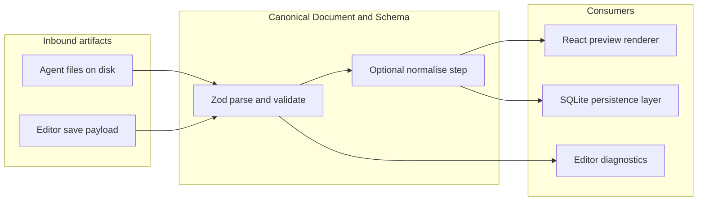

# Canonical Document & Schema

## 1. Component Overview

Diese Komponente definiert das **Canonical Document** für OpenFrame: ein **validiertes JSON-SSOT** für Seiteninhalte sowie das zugehörige **Projekt-Metadaten-File**. Sie ist die vertragliche Grenze zwischen **Editor**, **Preview-Renderer**, **Persistenz** und **externen Agenten** (Datei-basierte Edits). Sie lebt im **C4-Container „OpenFrame Web Application“** (Next.js-Monolith) als **wiederverwendbares Kern-Modul** ohne UI; Aufrufer sind Server-Routen, spätere API-Layer und Client-Code, der Dokumente einlesen oder serialisiert.

## 2. Architecture Diagram (Mermaid)

## 3. Public Interfaces (API)

Ziel: **eine klare, importierbare Modul-API** (TypeScript), die alle Eingaben über dieselbe Validierung schickt.

| Export / Funktion | Zweck |
| ----------------- | ----- |
| `openframePageDocumentSchema` | Zod-Schema für das **Seiten-Canonical-Document** (`version` + `root`-Baum). |
| `openframeProjectFileSchema` | Zod-Schema für **`openframe.project.json`** (Name, Default-Slug, Version). |
| `pageNodeSchema` | Rekursives Zod-Schema für einzelne Knoten. |
| `PageNode` / `OpenframePageDocument` | TypeScript-Typen (`z.infer`) für Renderer und Editor-State. |
| `BUILTIN_BLOCK_TYPES`, `listBuiltinBlockTypes`, `isBuiltinBlockType` | Allowlist der Built-in-Block-`type`-Strings (aligniert mit `blockRegistry`); siehe **`PreviewRenderer.md`**. |
| `OpenframeProjectFile` | Typ für Projekt-Metadaten. |
| `parsePageDocument(input)` | `safeParse` + **eindeutige `id`** über den gesamten Baum; Rückgabe `PageDocumentParseResult`. |
| `parsePageDocumentFromJson(text)` | `JSON.parse` + `parsePageDocument`; JSON-Syntaxfehler als `ZodError` mit Issue „Invalid JSON“. |
| Built-in **Allowlist** (`container`, `frame`, `text`) | Kurzbeschreibungen und Registry-Abgleich in **`PreviewRenderer.md`** und `src/lib/openframe/builtin-block-types.ts`. |
| **`openframe/openframe.schema.json`** | JSON-Schema-Snapshot der Baumstruktur (Agenten/Tooling); bei Änderungen an `pageNodeSchema` mitziehen. |
| `parseProjectFile(input)` | Analog; `ProjectFileParseResult`. |
| `parseProjectFileFromJson(text)` | JSON-String-Variante für Projekt-Dateien. |
| `@/lib/openframe` (`index.ts`) | Barrel-Reexport aller öffentlichen Symbole. |

**Konventionen:**

- **Nur** nach erfolgreicher Validierung dürfen andere Systeme (Persistenz, Renderer) als „commit-fähig“ behandeln.
- Fehlerobjekte von Zod werden **nicht** intern verschluckt; sie sind die Quelle für **Editor-Diagnostics** und für **Agent-Feedback** (z. B. CLI-Exit oder API-422).

## 4. Dependencies

| Abhängigkeit | Rolle |
| ------------ | ----- |
| **Zod** (`zod`) | Schema-Definition und Laufzeit-Validierung. |
| **TypeScript** | Strikte Typableitung aus Schemas. |
| *Zukünftig:* **Persistence** | Schreibt / liest serialisiertes JSON nur nach validiertem Dokument. |
| *Zukünftig:* **React Renderer** | Konsumiert nur validierte `OpenframePageDocument`-Instanzen. |
| *Zukünftig:* **Agent / Workspace Interop** | Schreibt `openframe.page.json`; dieses System ist die **Gatekeeper**-Validierung beim Import. |

**Keine** Abhängigkeit zu React, Datenbank oder Dateisystem **innerhalb** der Schema-Module selbst (reine Logik), damit Tests und Agenten die gleiche Validierung headless nutzen können.

## 5. Data Structures & State Management

### Kernstrukturen (MVP)

**Seiten-Document (`OpenframePageDocument`):**

- `version`: Literal `1` — explizite **Schema-Version** für spätere Migrationen (Bump → Transform-Pipeline außerhalb dieses Dokuments, aber Version-Feld wird hier enforced).
- `theme` *(optional, Phase 3)*: begrenzte Enums für Seiten-Shell (Radius, Color scheme, Typo-Skala) — siehe `page-document.ts` / `page-theme.ts`.
- `meta` *(optional, Phase 3)*: `title`, `description`, `ogImage` für Next **`generateMetadata`** (öffentliche Routen).
- `root`: rekursiver **`PageNode`**:
  - `id`: string, stabil innerhalb des Baums; Zod prüft `min(1)`, **`parsePageDocument`** lehnt **doppelte `id`** im gesamten Baum ab.
  - `type`: string — **logischer Block-Typ** (z. B. `container`, **`frame`**, `text`); welche Typen im MVP erlaubt sind, wird durch **Allowlist im Renderer/Editor** ergänzt, nicht zwingend durch Zod-Enum im ersten Schritt (KISS). Für **`frame`**-Props siehe `normalizeFrameProps` / `FrameBlock` (`frame-block.tsx`), inkl. Motion: **`scrollReveal`**, **`motionEngine`**, **`timelinePreset`**, **`scrollTrigger`** (`motion-contract.ts`, ADR **0004**). Für **`section`** dieselben Motion-Felder wie beim Frame.
  - `name` *(optional)*: string — **Anzeigename** im Editor (Layer-Baum, Properties); Zod trimmt und begrenzt (max. 128 Zeichen). **Stabile technische Identität** bleibt `id` (z. B. für Codegen); `name` muss nicht eindeutig sein.
  - `props`: `Record<string, unknown>` — freie aber **JSON-serialisierbare** Props.
  - `children`: `PageNode[]` — Baumkante.

**Projekt-Datei (`OpenframeProjectFile`):**

- `version`: Literal `1`
- `name`, `defaultPageSlug`: string, `min(1)`

### State / SSOT

- Das **Canonical Document** ist die **SSOT** für Seiteninhalt: Editor und Renderer sind **Projektionen** desselben validierten Objekts (`docs/01_Concept.md`, Contract-First).
- **Editor-UI-State** (Auswahl, Hover, Panel) lebt **nicht** im Canonical JSON und wird bewusst getrennt (z. B. Zustand im Editor-System), damit Agenten nicht „Zufalls-UI-State“ in Git schreiben.

## 6. Known Limitations / Edge Cases

- **Nur Version 1** der Schemas ist definiert; ältere oder neuere Dateien ohne Migration schlagen fehl.
- **`type` ist ungebunden**: beliebige Strings sind schema-legal; unbekannte Typen müssen der **Renderer** ablehnen oder **no-op** — sonst Risiko leerer Preview. Spätere Erweiterung: `z.enum` oder separates **Registry-System**.
- **ID-Eindeutigkeit** gilt pro Dokument über **`parsePageDocument`**; rohes `openframePageDocumentSchema.parse` ohne diese Hilfsfunktion erzwingt die Duplikat-Regel nicht.
- **Tiefe / Größe** des Baums: kein hartes Limit im Schema; sehr tiefe Bäume können Performance in Renderer und Diff-Tools treffen (Policy später).
- **Roundtrip mit freiem React/TSX** ist **explizit nicht** Teil dieses Systems (siehe MVP-Ruthless-Cuts in `docs/01_Concept.md`).
- **`props` ist `unknown`-reich**: fehlerhafte Typen in Props werden erst an **Komponenten-Grenzen** sichtbar; mittelfristig pro-`type` **feinere Zod-Schemas** oder JSON-Schema-Snapshots (`openframe.schema.json`) ergänzen.

## 7. Testing & Verification

| Aktion | Erwartung |
| ------ | --------- |
| `pnpm test` | Deckt u. a. `parsePageDocument`, Duplikat-IDs, `parsePageDocumentFromJson`, Fixture `openframe/examples/openframe.page.json` sowie `parseProjectFile*` ab (`src/lib/openframe/*.test.ts`). |
| Dev-UI | Mit laufendem `pnpm dev`: **`/try/canonical`** — JSON editieren und `parsePageDocumentFromJson` / `parseProjectFileFromJson` im Browser ausprobieren (Link auch von der Startseite). |
| Manuell: gültige `openframe/examples/openframe.page.json` | `parsePageDocumentFromJson` akzeptiert die Datei (siehe Test). |
| Manuell: ungültiges JSON | `parsePageDocumentFromJson` liefert `ok: false` mit `ZodError`; keine Persistenz / kein Renderer-Commit. |

**Erweiterung nach Implementierung weiterer Systeme:**

- Kontrakt-Tests zwischen **diesem Modul** und **Persistence** (Roundtrip: DB-String → parse → gleiche Normalform).
- Golden-File-Tests für Agenten-Beispiele unter `openframe/examples/`.

---

*Stand: Kern-API in `src/lib/openframe/` implementiert; Persistenz- und Renderer-Anbindung folgen in weiteren Systemen.*
