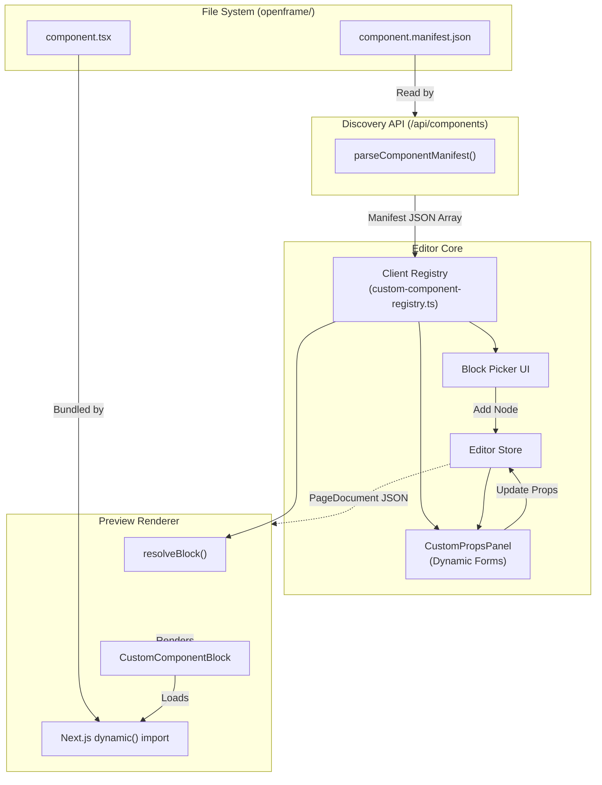

# Custom Components (Code Components)

## 1. Component overview

The Custom Components system allows users or AI agents to extend OpenFrame with their own React components. Instead of hardcoding all blocks into the core editor, custom components are discovered via the filesystem in the `openframe/components/` directory.

The system uses a **Contract-First** architecture. The single source of truth for a custom component is its `component.manifest.json` file. This manifest defines the property schema, the editor UI controls, and metadata, keeping the editor completely decoupled from the React execution environment.

## 2. Architecture diagram



## 3. Developer Guide: Creating a Component

To create a new code component, follow these steps:

### Step 1: Create the folder
Create a new directory in `openframe/components/<component-name>/`. The folder name must match the component's internal `name`.

### Step 2: Define the Manifest
Create `component.manifest.json`. This is the "contract" between your code and the OpenFrame editor.

```json
{
  "version": 1,
  "name": "my-button",
  "displayName": "Action Button",
  "description": "A customizable button with primary/secondary styles.",
  "icon": "hand-pointing",
  "propertyControls": {
    "label": {
      "title": "Label",
      "type": "string",
      "defaultValue": "Click me"
    },
    "variant": {
      "title": "Style",
      "type": "enum",
      "options": ["primary", "secondary"],
      "defaultValue": "primary"
    }
  }
}
```

### Step 3: Implement the React Component
Create `<component-name>.tsx` in the same folder. It must be a **default export**.

```tsx
"use client";

interface Props {
  label: string;
  variant: "primary" | "secondary";
}

export default function MyButton({ label, variant }: Props) {
  return (
    <button className={variant === "primary" ? "bg-blue-500" : "bg-gray-500"}>
      {label}
    </button>
  );
}
```

## 4. Property Controls Reference

The following control types are available for use in `propertyControls`:

| Type | Description | Key Options |
| :--- | :--- | :--- |
| `string` | Text input | `multiline`, `placeholder`, `maxLength` |
| `number` | Numeric input | `min`, `max`, `step`, `unit` |
| `boolean`| Checkbox | - |
| `enum`    | Select dropdown | `options`, `optionLabels` |
| `color`   | Color picker | - |
| `image`   | Image URL field | - |
| `array`   | List of items | `itemControl`, `maxItems` |
| `object`  | Nested fields | `fields` |

### Conditional Visibility
You can hide controls based on other prop values using the `hidden` field:
```json
"badgeText": {
  "type": "string",
  "hidden": { "prop": "showBadge", "is": false }
}
```

## 5. Technical Details

- **Dynamic Loading**: Components are loaded via `next/dynamic` from the `openframe/components/` directory. Webpack creates a context module for this path, allowing arbitrary `.tsx` files to be bundled as async chunks.
- **SSR Support**: Custom components support Server-Side Rendering. If a component requires browser APIs (like `window`), use `"use client"` and handle hydration accordingly.
- **Children**: If `acceptsChildren` is true in the manifest, the component will receive a `children` prop containing the rendered OpenFrame sub-tree.

## 6. Known limitations

- **Tailwind JIT**: Since custom components live outside the standard `src/` directory, ensure `openframe/components/**/*.tsx` is included in your `tailwind.config.ts` content array to allow JIT styling to work.
- **Registry Refresh**: The editor loads manifests on mount. If you add a new component folder while the editor is open, you may need to refresh the page to see it in the block picker.
