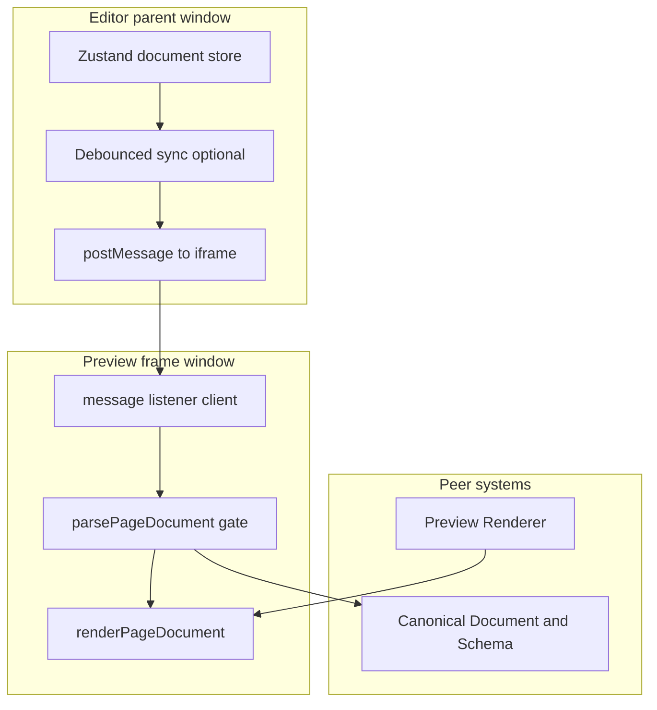

# Draft Preview

## 1. Component Overview

**Draft Preview** zeigt den **aktuellen Editor-Entwurf** (`OpenframePageDocument` im Client) in der **gleichen isolierten iframe-Vorschau** wie die persistierte Preview — **ohne** vorheriges Speichern in SQLite. Sie verbindet **Editor Core** (Zustand) und **Preview Renderer** (React-Projektion) über ein **explizites, same-origin-`postMessage`-Protokoll**, damit die Vorschau **live** bleibt, während Persistence unverändert der **Quelle nach Save** vorbehalten ist. Die Komponente lebt im **C4-Container „OpenFrame Web Application“** (Browser: Parent-Seite + iframe-Child); der Server liefert nur die **Rahmen-Route** und optional Weichen, der **laufende Entwurf** fließt **nicht** über neue REST-Endpunkte.

## 2. Architecture Diagram (Mermaid)

**Kernfluss:** Bei Änderungen am Dokument serialisiert der Editor ein **validierbares** JSON (oder übergibt ein bereits validiertes Objekt nach **`parsePageDocument`**) und sendet es an das iframe. Das Child validiert erneut (**Defense in depth**), rendert mit **`renderPageDocument`** — **ohne** zusätzlichen „Preview/Draft“-Chrome im Frame (nur Seiteninhalt; ungültige Payloads weiter als Fehlerzeile).

**Zusatzfluss Pan/Zoom:** Das iframe sendet bei bedarf **`postMessage`** an **`window.parent`** (nur **`window.location.origin`** als `targetOrigin`) — siehe **`preview-wheel-bridge.ts`** und Abschnitt 3. Der **Editor** validiert **`ev.source === draftIframe.contentWindow`** und **`ev.origin`** vor der Anwendung.

## 3. Public Interfaces (API)

Implementiert unter `src/lib/preview/draft-protocol.ts`, **`preview-wheel-bridge.ts`**, `draft-preview-frame.tsx`; Frame-Route in `src/app/admin/preview/frame/page.tsx`; Editor in `src/app/admin/editor/editor-app.tsx`. Reexports: **`@/lib/preview`** (`index.ts`).

| Funktion / Baustein | Zweck |
| ------------------- | ----- |
| **`OPENFRAME_DRAFT_MESSAGE_TYPE`** in `draft-protocol.ts` | Envelope-String **`openframe:draft-document.v1`**. |
| **`postDraftToPreview`**, **`handleDraftMessageEvent`** | Parent: validiert, `postMessage` mit App-Origin; Child: **Origin-Check** + **`parsePageDocument`**. |
| **`OPENFRAME_PREVIEW_WHEEL_BRIDGE_TYPE`** (`openframe:preview-wheel-bridge.v1`) | Child → Parent: **`payload`** mit **`deltaX`**, **`deltaY`**, **`deltaMode`**, **`ctrlKey`**, **`metaKey`** (wie **`WheelEvent`**). Nur gesendet, wenn das iframe nach **`wheelCanScrollNativeChain`** kein natives Scrollen behalten soll; sonst bleibt Standard-Scroll im Frame. |
| **`OPENFRAME_PREVIEW_PINCH_BRIDGE_TYPE`** (`openframe:preview-pinch-bridge.v1`) | Child → Parent: **`payload`** = **`{ phase: "start" }`**, **`{ phase: "change", scale }`**, **`{ phase: "end" }`** — entspricht Safari-**`GestureEvent`**-Semantik im iframe (nur wenn **`GestureEvent`** existiert). |
| **`normalizeWheelPixelDeltas`**, **`wheelCanScrollNativeChain`**, **`isPinchZoomWheelEvent`**, **`isPinchZoomWheelFlags`**, **`isPreviewWheelBridgeMessage`**, **`isPreviewPinchBridgeMessage`** | Pure Hilfen + Typ-Gates in **`preview-wheel-bridge.ts`**; Editor und Frame teilen sich die Normalisierung (inkl. **`DOM_DELTA_LINE`** / **`DOM_DELTA_PAGE`**). |
| **`DraftPreviewFrame`** | Client-Komponente: **`message`** für Dokument-Sync; **Capture-`wheel`** (`passive: false`) und optional **`gesture*`** → **`postMessage`** an Parent; **`renderPageDocument`** ohne Marketing-/Draft-Banner. |
| **`/admin/preview/frame?draft=1`** | Server-Route rendert nur **`DraftPreviewFrame`** (DB-Slug-Rendering ist nach **`/[slug]`** umgezogen, siehe **`PublicSite.md`**). |
| **Editor (`EditorApp`)** | iframe **`/admin/preview/frame?draft=1`**; **120 ms Debounce** + **`onLoad`**-Push; **Transform-Layer** mit **Standard-Breakpoints** und **nutzerdefinierten** Canvas-Größen (**`preview-breakpoints.ts`**, **`localStorage`**). **Canvas-Höhe:** pro Seite im Canonical Document optional **`previewViewport`** (`heightMode`: Breakpoint-Preset-Höhe \| **fit** \| **fixed** mit **px**/**vh**); im Modus **fit** meldet das iframe die **intrinsische** Inhaltshöhe (nur der gerenderte Baum) per **`openframe:preview-content-size.v1`** an den Parent — der Draft-Frame setzt dazu **`html`/`body`** auf automatische Höhe, damit das Root-Layout (**`min-h-full`**) nicht die iframe-Zielhöhe zurückspiegelt (sonst Rückkopplung mit der Canvas-Höhe). **`wheel`** / **`gesture*`** am **DOM-**`document` in Capture + Viewport-Hit-Test; **`window`**-**`message`** für Wheel-/Pinch-Bridges und Content-Höhe. Details: **`EditorCore.md`**. |

## 4. Dependencies

| Abhängigkeit | Nutzung |
| ------------ | ------- |
| **Canonical Document & Schema** | Jede Payload **muss** durch **`parsePageDocument`** im iframe (und idealerweise vor dem Senden im Parent) — gleiche Regeln wie Persistence. |
| **Preview Renderer** | Unverändert **`renderPageDocument`** + Block-Registry; kein zweiter Render-Pfad. |
| **Editor Core** | Liefert das **Entwurfs-SSOT**; Draft Preview **ersetzt** nicht den Store, sie spiegelt ihn nur. |
| **Persistence / Slug-Preview** | Unverändert: **`?slug=`** lädt weiterhin aus der DB im Server-Frame; Draft-Modus ist **orthogonal** (entweder klar getrennte URLs oder definierte Priorität: z. B. Draft-Nachricht überschreibt nur im Draft-Modus). |

## 5. Data Structures & State Management

- **Payload:** JSON-kompatibles Abbild von **`OpenframePageDocument`** (Version 1), gleiche Form wie **`GET /api/pages/:slug`**-Body.
- **Kein Server-State** für Draft im MVP: kein temporäres Speichern in SQLite nur für Vorschau.
- **Parent:** Editor-Store bleibt **einzige** Bearbeitungs-Quelle; iframe ist **read-only** Projektion (kein Roundtrip aus dem Frame in den Store im ersten Schritt).
- **Synchronisation:** Event-getrieben (Nachricht pro Änderungsbatch), nicht kontinuierliches Polling.

## 6. Known Limitations / Edge Cases

- **Trackpad / Rad (Mittelweg):** Im **Parent** weiterhin **`wheel`** in **Capture** + **Viewport-Rechteck** (nur wenn der Zeiger über dem Preview-Viewport liegt). Über dem **Seiten-Inhalt** läuft das Rad im **iframe-Dokument**; dort fängt **`DraftPreviewFrame`** in Capture (`passive: false`) ab: Wenn **`wheelCanScrollNativeChain`** eine **scrollbare Vorfahrenkette** mit noch **Scrollraum in Richtung des Deltas** findet (`overflow` auto/scroll/overlay), bleibt **natives Scrollen** im Frame. Sonst **`preventDefault`** + Bridge an den Editor — gleiche Pan-/Zoom-Logik wie über dem grauen Rand; **Textauswahl** bleibt möglich (kein **`pointer-events: none`** auf dem iframe). **Safari-Pinch:** **`gesture*`** im iframe → Pinch-Bridge; der Parent registriert zusätzlich **`gesture*`** für Gesten über dem **Rand** außerhalb des iframe-Ziels. **Leertaste:** Hand-Modus mit transparentem **Overlay** (`pointer-events: auto`) über der Vorschau, damit Rad/Pan auch über dem iframe funktionieren; **`activeElement`**-Prüfung nutzt im Editor das **DOM-**`document` (**`globalThis.document`**), nicht den Store **`document`** (siehe **Editor Core**).
- **Scroll-Grenzen:** Wenn ein scrollbares Element am **Ende** der Kette ist, wird aktuell **nicht** automatisch zum Canvas-Pan „durchgereicht“ (kein Scroll-Chaining zum Parent) — bewusst einfache Heuristik.
- **Doppelte Pinch-Signale:** Auf manchen macOS-/Safari-Kombinationen können **Pinch** sowohl als **`GestureEvent`** als auch als **⌃-Wheel** auftreten; bei Auffälligkeiten ggf. entkoppeln oder drosseln.
- **Standalone-Frame:** Wird **`/admin/preview/frame?draft=1`** ohne Parent-iframe geöffnet, laufen Bridge-Listener trotzdem; **`postMessage`** geht an **`window.parent`** (bei gleichem Fenster unkritisch, keine Editor-Verarbeitung).
- **Größe / Performance:** Sehr große Bäume erhöhen **postMessage**-Kosten — Debouncing und ggf. zukünftige **Diff-only**-Protokolle (nicht MVP) sind mögliche Erweiterungen.
- **`event.origin`:** Strikt prüfen; Nachrichten von anderen Origins verwerfen (auch wenn `targetOrigin` falsch gesetzt wurde).
- **Hydration:** Die Draft-Frame-Route benötigt eine **Client-Komponente** für `message` und React-Updates; SSR liefert nur Hülle, erster sinnvoller Inhalt oft nach erstem Client-Render + Nachricht.
- **Persistenz:** Nach **Save** bleibt der Entwurf im Editor-iframe die gleiche Projektion; die gespeicherte Ansicht ist unter der **Public-URL** **`/<slug>`** erreichbar — der **„View site“**-Button in der Top-Bar öffnet sie direkt.
- **Fehlerhafte Payload:** Validierung schlägt fehl → letzter guter Stand beibehalten oder kurze Fehlerzeile im Frame, **ohne** den Editor-Store zu überschreiben.

## 7. Testing & Verification

| Methode | Zweck |
| ------- | ----- |
| `pnpm test` | **`draft-protocol.test.ts`** — Envelope, Origin, **`postDraftToPreview`**; **`preview-wheel-bridge.test.ts`** — Bridge-Envelopes und **`normalizeWheelPixelDeltas`**. |
| `pnpm dev` | Editor: Draft-iframe bearbeiten, Breakpoints/Zoom/Fit; Save; gespeicherte Seite über **`/<slug>`** öffnen (Top-Bar **„View site“**); optional **`/admin/preview/frame?draft=1`** standalone. |
| Manuell | Nur **gleiche Origin**; fremde `event.origin` wird ignoriert. |

---

*Stand: Draft-Sync per `postMessage`; zusätzlich Wheel-/Pinch-Bridge aus dem Frame bei nicht-nativem Scroll; Editor-Viewport mit Transform (Breakpoints, Zoom, Pan, Fit, Space-Hand).*
