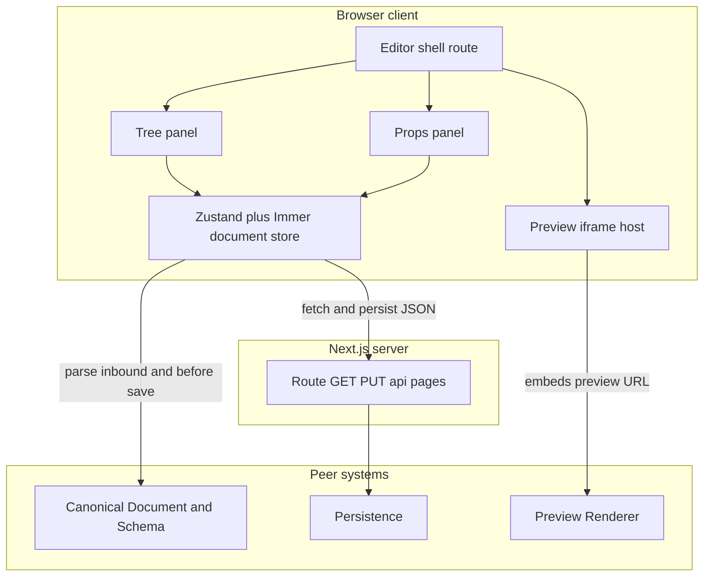

# Editor Core

## 1. Component Overview

**Editor Core** ist die **Client-seitige Schicht** des visuellen Builders und das Kernstück des **Studios unter `/admin/*`** (WordPress-artige Backend/Frontend-Trennung; Public Site siehe **PublicSite.md**). Er hält den **Arbeitszustand** eines `OpenframePageDocument`, ermöglicht **Baumnavigation**, **Auswahl**, **strukturierte Prop-Bearbeitung** für das MVP-Block-Set und **Speichern** über die bestehende Pages-API. Er lebt im **C4-Container „OpenFrame Web Application“** primär im **Browser** (React auf der Route **`/admin/editor`**; Studio-Hub unter **`/admin`** mit Einstieg zu Editor und Settings); Server-Logik beschränkt sich auf **HTTP-Aufrufe** zu Persistence — **kein** direkter SQLite-Zugriff im Client.

## 2. Architecture Diagram (Mermaid)

**Lesepfad:** `GET /api/pages/[slug]` → validiertes Dokument in den Store; **Schreibpfad:** Store-Dokument → erneute Validierung → `PUT /api/pages/[slug]`.

**Preview:** Im Editor zeigt ein iframe **`/admin/preview/frame?draft=1`** den **Live-Entwurf** per **`postMessage`** (Dokument-Sync). **Pan/Zoom** kombinieren Parent-**`wheel`**/**`gesture*`** (Capture, Viewport-Hit-Test) mit **Wheel-/Pinch-Bridges** aus dem iframe, wenn das Rad im Frame-Dokument nicht an eine scrollbare Kette geht — siehe **`DraftPreview.md`**. Gespeicherte Seiten erreicht man jetzt direkt unter **`/<slug>`** (siehe **`PublicSite.md`**); im Editor öffnet **„View site“** in der Top-Bar diese URL in einem neuen Tab.

## 3. Public Interfaces (API)

Implementiert unter `src/lib/editor/` und `src/app/admin/editor/`.

| Funktion / Baustein | Zweck |
| ------------------- | ----- |
| **`useEditorStore`** in `editor-store.ts` | Zustand + Immer: `document`, `slug`, `selectedNodeId`, `status`, `lastError`, `isDirty`, `previewNonce` plus Undo/Redo-History (`historyPast`, `historyFuture`). Aktionen: `loadPage`, `savePage`, `selectNode`, `updateNodeProps`, `removeSelectedNode`, `duplicateSelectedNode`, `moveSelectedNode("up"|"down")`, `undo`, `redo`, `addChildTo` (insert `text`, **`frame`**, **`heading`**, **`link`**, **`button`**, **`image`** under `container` / **`frame`**; optional `selectNew: false` fuer Batch-Add), `addTextChildTo` (Alias fuer `addChildTo(…, "text")`), `reset`. |
| **`getStarterPageDocument`** in `starter-document.ts` | Validiertes Default-Baum bei **404** auf `GET`. |
| **`tree.ts`** | `findNodeById`, `removeNodeById` für Baum-Mutationen. |
| **`EditorApp`** in `editor-app.tsx` | **Shell:** Drei-Spalten-Layout (linkes Panel: **segmentierte Tabs** Pages / Layers / Assets; **Pages:** Liste aus **`GET /api/pages`** plus aktuellem Slug, **+** öffnet eine **Inline-Zeile** mit Slug-Eingabe (Enter/Blur bestätigt, Escape/leerer Name bricht ab), Zeilen-Menü per Hover öffnet **`/<slug>`** in neuem Tab; **Layers:** Suche filtert den Baum, **Dropdown** für schnellen Seitenwechsel · Previews · **rechtes Properties-Panel:** Kopf mit Typ-Chip, editierbarem **Layer-Namen** (`PageNode.name`), ausklappbarem **Internal ID** (`id` für Codegen), Schnellaktionen (**Move up/down**, **Duplicate**, **Remove**), Trennlinie, Sektionen wie Framer z. B. **Text** (inkl. Element/max width), **Heading**, **Link**, **Button**, **Image** (inkl. Datei-Upload via `POST /api/assets/upload`), **Section** (Anchor + `paddingY` Preset fuer vertikales Spacing); bei **`frame`**: Layout, Spacing, Alignment, Position (flow/absolute + Insets), Stacking (overflow, z-index), Breite, Add blocks, volle Breite für Textarea und Aktions-/Danger-Buttons). **Add blocks:** `Shift+Click` behaelt den Parent selektiert (Batch-Add). **Layers-Baum:** zeigt Anzeigenamen (oder Defaults wie „Page“ / „Text“), nicht die technische `id`; Drag-and-drop-Reordering unterstützt jetzt auch Parent-Wechsel, sofern die Parent/Child-Regeln (`tree-rules.ts`) dies erlauben (z. B. `section` und `container` nur unter Root); bei aktiver Suche bleibt DnD deaktiviert. Nodes mit Children sind einklappbar; beim selektierten Node werden Descendants subtil markiert. Farben: **`[data-editor-chrome]`** + Variablen + **`.ec-*`**-Klassen in **`editor-theme.css`**. **Top-Bar:** links **OpenFrame**-Brand (Link **`/admin`**) + aktueller Slug-Pfad; rechts **Status-Pill** (Saved / Unsaved / Loading), **„View site“** (öffnet **`/<slug>`** im neuen Tab), Link **Settings** → **`/admin/settings`**, **Undo/Redo**, **Save** (nur aktiv bei **`isDirty`** und geladenem Dokument; sonst **`disabled`**). **Tastatur:** **`Ctrl+S`** / **`⌘S`** (Save), **`Ctrl+Z`** / **`⌘Z`** (Undo), **`Ctrl+Shift+Z`** / **`⌘⇧Z`** / **`Ctrl+Y`** (Redo), **`Ctrl+D`** / **`⌘D`** (Duplicate), **Delete/Backspace** (Remove, nicht in Input/Textarea/ContentEditable). **Kein** Slug-Eingabefeld, **kein** Load-Button mehr — Page-Wechsel ausschließlich im Pages-Panel; URL wechselt via `router.replace("/admin/editor?slug=…")`. **Wichtig:** Der Store exportiert **`document`** (`OpenframePageDocument \| null`) — für **DOM-APIs** (`addEventListener`, **`activeElement`**) immer **`globalThis.document`** bzw. eine lokale Variable **`dom`** verwenden, sonst **Runtime-Fehler** oder falsche **Space**-Hand-Logik. |
| **`/admin/editor/page.tsx`** | Server Component: `searchParams.slug` (Default **`home`**). `EditorApp` bleibt beim Slug-Wechsel **gemountet** (kein `key`-Remount), damit z. B. der aktive Sidebar-Tab erhalten bleibt; `initialSlug` triggert `loadPage` und steuert die Top-Bar-Anzeige. |
| **`/admin/page.tsx`** | Server Component: **Studio-Hub** mit Links zu **`/admin/editor?slug=home`**, **`/admin/settings`** und **`/`** (Public Site). |
| **`/admin/settings/page.tsx`** | Referenz-UI: externe Agenten-Werkzeuge (Claude CLI, Cursor, Antigravity, VS Code Copilot, Claude App), Pages-API-Kurzreferenz, Tastenkürzel — **keine** direkte Modell-Integration in der App. |
| **Preview-Einbettung** | **Nur Draft:** iframe **`/admin/preview/frame?draft=1`** + **`postDraftToPreview`** (debounced) mit **Transform-Layer**. **Presets:** drei Built-ins + **Custom** (px, **`localStorage`** `openframe.editor.previewBreakpoints.custom.v1`, aktives Preset `…ActiveId.v1`). **Chrome:** kompakte Zeile — bis **`PREVIEW_BP_INLINE_MAX`** (4) Presets inline (**aktives** immer dabei), Rest im **Chevron-**`details`-Menü; **„Viewport“**-`details` öffnet Formular zum Hinzufügen. **Preset-Wechsel** ändert **nicht** automatisch Zoom/Pan. **Fit:** Zoom nur nach **Viewport-Breite**; **`pan.x`** auf **0** (horizontal zentriert), **`pan.y`** unverändert. **Zoom** (+/−), **Pan**, **Leertaste**-Hand, **`wheel`**/**`gesture*`**/**`message`**-Bridges — **`DraftPreview.md`**, **`preview-wheel-bridge.ts`**, **`preview-breakpoints.ts`**. **`previewNonce`** im Store. |

## 4. Dependencies

| Abhängigkeit | Nutzung |
| ------------ | ------- |
| **Canonical Document & Schema** | Einlesen und jede strukturelle Änderung gegen **`OpenframePageDocument`** / Zod; Duplikat-IDs und ungültige Bäume im Editor verhindern oder abweisen. |
| **Persistence** (über HTTP) | `GET`/`PUT` **`/api/pages/[slug]`** — einziger persistenter Kanal im MVP. |
| **Preview Renderer** | Visuelle Rückkopplung im Editor über **`/admin/preview/frame?draft=1`**; öffentliche Ansicht persistierter Seiten unter **`/<slug>`** (siehe **`PublicSite.md`**). |
| **Tech-Stack** | **Zustand**, **Immer**, **@dnd-kit** (optional für Baum), **Tailwind** + UI-Bausteine für Shell und Formulare. |

## 5. Data Structures & State Management

- **Kern:** Ein **`OpenframePageDocument`** im Store (Referenz auf validiertes Objekt; Updates über Immer-Produzenten).
- **Selektion:** `selectedNodeId: string | null` — muss im Baum existieren oder `null` nach Löschung/Strukturwechsel bereinigt werden.
- **Metadaten:** `slug` der bearbeiteten Seite, `status: idle | loading | saving | error`, `lastError` für API/Zod (typisierte Darstellung in der UI).
- **Dirty-Flag:** optional `isDirty` zur Warnung vor Verlassen; Undo/Redo bewusst **nicht** MVP-Pflicht (siehe Konzept Should-Have).

## 6. Known Limitations / Edge Cases

- **Kein gleichzeitiger Mehrbenutzerbetrieb** — letzter Speichergewinn ohne Merge; kein ETag im MVP vorgesehen.
- **Vorschau vs. Entwurf:** Der Draft-iframe folgt dem Store per **`postMessage`**; ohne Save weicht der Inhalt von der **Public-Route** **`/<slug>`** ab, bis gespeichert wurde.
- **Block-Set begrenzt** — Props-Panel nur für dokumentierte Typen; unbekannte `type`-Knoten: Auswahl und rohe Anzeige minimal, kein vollständiger generischer Editor im ersten Schritt.
- **Validierungsfehler** vom Server (422) müssen lesbar im Editor landen, ohne den lokalen Entwurf still zu verwerfen.
- **Namenskollision `document`:** In **`EditorApp`** bezeichnet **`document`** das **Seiten-Dokument** aus dem Store, nicht das **DOM-**`document`. Effekte für Preview-Input dürfen nur **`globalThis.document`** nutzen (siehe **Public Interfaces**).

## 7. Testing & Verification

| Methode | Zweck |
| ------- | ----- |
| `pnpm test` | **`src/lib/editor/editor-store.test.ts`**, **`tree.test.ts`**; zentral **`src/lib/preview/draft-protocol.test.ts`**, **`preview-wheel-bridge.test.ts`**, **`src/app/admin/editor/preview-breakpoints.test.ts`**, **`src/lib/persistence/slug.test.ts`** (reservierte Studio-Slugs). |
| `pnpm dev` | **`/admin`** Hub; **`/admin/editor?slug=home`**; **`/admin/settings`**; Page-Wechsel im Pages-Panel; **„View site“** öffnet **`/<slug>`**; **Ctrl+S / ⌘S** speichert bei **`isDirty`**; Pan/Zoom über **Rand** und **iframe-Inhalt**. |
| API | `GET`/`PUT /api/pages/[slug]` wie in Persistence, plus `POST /api/assets/upload` (Image Upload) und `GET /api/assets/[filename]` (ausgelieferte Upload-Datei). |

---

*Stand: Studio unter `/admin/*` (Hub, Editor, Settings, Draft-Frame); Top-Bar inkl. Undo/Redo/Save; Layer-Schnellaktionen (Move, Duplicate, Remove); Batch-Add via Shift+Click; Image Upload API; Public-Site unter `/[slug]` und `/`; Transform-Viewport; Wheel/Gesture-Bridges; `globalThis.document` fuer DOM-Listener und Space-Hand.*
