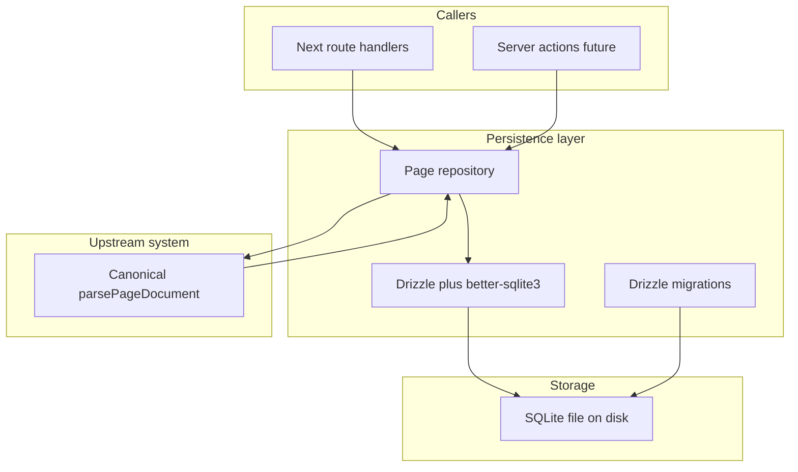

# Persistence

## 1. Component Overview

**Persistence** speichert und lädt **Seiten-Canonical-Dokumente** (als serialisiertes JSON) in einer **SQLite-Datenbank** über **Drizzle ORM** und **`better-sqlite3`**. Sie ist die **dauerhafte Sicht** auf den SSOT, sobald Inhalte über den reinen Browser hinaus überleben sollen. Die Komponente lebt im **C4-Container „OpenFrame Web Application“** ausschließlich auf dem **Node.js-Server** (Route Handlers, Server Actions, Hintergrundjobs) — **nicht** im Edge-Runtime und nicht im Client-Bundle, weil native SQLite-Bindings verwendet werden.

## 2. Architecture Diagram (Mermaid)

**Lesepfad:** `SqliteFile` → `DrizzleClient` → `Repo` → JSON-String deserialisieren → optional erneut **`parsePageDocument`** zur harten Validierung gespeicherter Daten.

**Schreibpfad:** eingehendes `unknown` oder bereits validiertes Dokument → **`parsePageDocument`** (Gatekeeper) → `Repo` → `INSERT` oder `UPDATE` mit `document_json` + `updated_at`.

## 3. Public Interfaces (API)

Ziel: eine **schmale, testbare Repository-API** — implementiert unter `src/lib/persistence/` und `src/app/api/pages/`.

| Funktion / Modul | Zweck |
| ---------------- | ----- |
| `createPageRepository(database)` | Factory; liefert ein Repository gebunden an eine **Drizzle-`AppDb`**-Instanz (Tests: `:memory:`, App: `db` aus `@/db/client`). |
| `getPageBySlug(slug)` | Liest `pages`, parst `document_json`, validiert mit **`parsePageDocument`**; Rückgabe `GetPageResult` (`not_found`, `invalid_json`, `invalid_stored` + `zodError`). |
| `upsertPageFromInput(slug, input)` | **`parsePageDocument(input)`** Gatekeeper, dann Upsert; Rückgabe `UpsertPageFromInputResult`. |
| `upsertPageDocument(slug, doc)` | Erneute Validierung per **`parsePageDocument(doc)`**, dann `INSERT`/`ON CONFLICT` auf `slug`; MVP: **`id === slug`**. |
| `listPageSlugs()` | Alle Slugs sortiert aufsteigend. |
| `pageRepository` | **`@/lib/persistence/server`** — `server-only` gebundener Singleton um `db`. |
| **HTTP** | `GET/PUT /api/pages/[slug]`, `GET /api/pages` — `runtime = nodejs`, Slug-Validierung via **`isSafePageSlug`**. |
| `db` / Drizzle-Client | Weiterhin nur für Migrationen / interne Server-Nutzung (`@/db/client`). |

**Konventionen:**

- Jeder **Write** geht über **Canonical Document & Schema** (`parsePageDocument` / `parsePageDocumentFromJson`), siehe `docs/systems/CanonicalDocumentSchema.md`.
- **HTTP-Status**: Validierungsfehler → **4xx** mit strukturierter Fehlerliste (Zod issues), nicht **5xx**.

## 4. Dependencies

| Abhängigkeit | Rolle |
| ------------ | ----- |
| **[Canonical Document & Schema](./CanonicalDocumentSchema.md)** | Pflicht-Validierung vor Persistenz und nach dem Lesen. |
| **drizzle-orm** | Typisierte Queries und Schema-Definition. |
| **better-sqlite3** | Synchrones SQLite-Binding für Node. |
| **drizzle-kit** | Migrationen und `db:push` / `db:studio` im Dev-Workflow. |
| **Node.js `fs` / `path`** | Anlegen des DB-Verzeichnisses, Auflösung von `DATABASE_PATH`. |
| **Next.js App Router** | Ausführungskontext für Server-Code; Routen mit `export const runtime = "nodejs"` wo nötig. |

**Keine** direkte Abhängigkeit zu React; UI ruft nur indirekt über Server-Routen auf.

## 5. Data Structures & State Management

### Tabellen-MVP: `pages`

| Spalte | Typ | Bedeutung |
| ------ | --- | --------- |
| `id` | `TEXT` PK | Stabile Seiten-ID (z. B. UUID oder slug-basiert — Implementierung entscheidet; Dokumentation im Code). |
| `slug` | `TEXT` UNIQUE NOT NULL | URL- oder Projekt-sichtbarer Schlüssel (z. B. `home`). |
| `document_json` | `TEXT` NOT NULL | `JSON.stringify(OpenframePageDocument)` nach erfolgreichem Parse. |
| `updated_at` | `INTEGER` | Unix-Zeit in ms oder s — einheitlich im Code festlegen. |

**Projekt-Metadaten** (`OpenframeProjectFile`) sind im MVP **noch nicht** zwingend in SQLite abgebildet; Option A: eigene Tabelle `project` später, Option B: eine Zeile in `pages` mit festem slug `__project__` — **ADR oder Implementierungskommentar** bei der ersten Erweiterung.

### State

- **SSOT bleibt** das logische Canonical-Document; die DB ist **Persistenz-Abbild**.
- Kein **Client-seitiger** SQLite-Zugriff; Editor-State (Zustand) bleibt getrennt bis „Save“.

## 6. Known Limitations / Edge Cases

- **Single-file SQLite**: kein eingebautes Multi-Node-Replikat; gleichzeitige Schreibzugriffe sind begrenzt (WAL kann helfen, bleibt aber Single-Host).
- **`better-sqlite3` + Edge**: Edge Runtime ist **nicht** unterstützt — falsche Runtime führt zu Build- oder Laufzeitfehlern.
- **Deployment**: Dateipfad `DATABASE_PATH` / `.data/` muss auf dem Host **persistent** sein (siehe `README.md` Hostinger-Hinweis).
- **Migrationen**: Schema-Änderungen erfordern Drizzle-Migrationen; alte `document_json`-Zeilen brauchen ggf. **Daten-Migrationen** getrennt von SQL-Migrationen.
- **Keine automatische Bereinigung** verwaister Knoten-IDs in der DB bei Schema-Bumps — das ist Aufgabe expliziter Migrations-Skripte.
- **Lesen ohne Re-Validate** wäre riskant; Empfehlung: immer **`parsePageDocument`** nach `JSON.parse` des gespeicherten Strings.

## 7. Testing & Verification

| Aktion | Erwartung |
| ------ | --------- |
| `pnpm db:push` | Wendet aktuelles Drizzle-Schema auf die lokale SQLite-Datei an (`.env` / `DATABASE_PATH`). |
| `pnpm db:studio` | Manuelle Inspektion von `pages` und `document_json`. |
| `pnpm test` | **`page-repository.test.ts`** (In-Memory-SQLite), **`slug.test.ts`**, plus bestehende Canonical-Tests. |
| API manuell | Nach `pnpm db:push`: `GET /api/pages`, `PUT /api/pages/home` mit gültigem Page-JSON, `GET /api/pages/home`; ungültiger Body → **400** mit `issues`. |

**Manuell:** Seite per `PUT` speichern, Dev-Server neu starten, prüfen ob Daten in `.data/openframe.db` noch lesbar und erneut **`parsePageDocument`**-kompatibel sind (`pnpm db:studio` oder `GET`).

---

*Stand: Repository, `server-only`-Singleton und `/api/pages`-Routen sind implementiert.*
