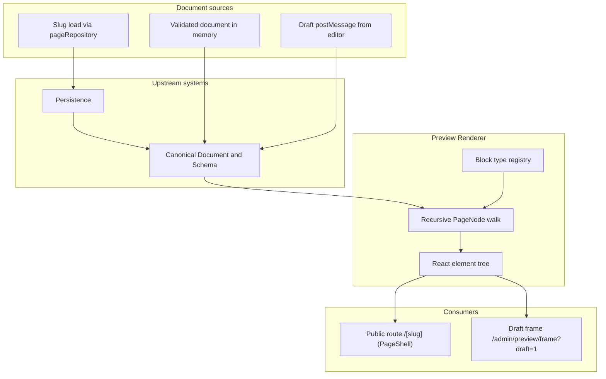

# Preview Renderer

## 1. Component Overview

Der **Preview Renderer** wandelt ein **validiertes** `OpenframePageDocument` in einen **React-Elementbaum** um. Er ist die **Laufzeit-Projektion** des Canonical SSOT und wird von zwei Aufrufern gemeinsam genutzt: vom **Public Site Renderer** unter **`/[slug]`** (siehe **`PublicSite.md`**) für persistierte Seiten und vom **Draft Preview Frame** unter **`/admin/preview/frame?draft=1`** (siehe **`DraftPreview.md`**) für den unsaved Editor-Entwurf. Die Komponente lebt im **C4-Container „OpenFrame Web Application“** (Next.js + React 19) und soll **keine** Editor-Chrome-Logik enthalten.

## 2. Architecture Diagram (Mermaid)

**Kernfluss:** Nur **`OpenframePageDocument`** (nach **`parsePageDocument`**) wird gerendert; unbekannte `type`-Strings fallen auf eine **definierte Fallback-Darstellung** zurück (kein stiller Leer-Render ohne Hinweis).

## 3. Public Interfaces (API)

Ziel: kleine, testbare Oberfläche — implementiert unter `src/lib/preview/`.

| Funktion / Baustein | Zweck |
| ------------------- | ----- |
| **`blockRegistry`** in `block-components.tsx` | `type` → Komponente: `container`, `frame`, `text`, `heading`, `link`, `button`, `image`, `section`, `split`, `card` — siehe `*-block.tsx` und **`frame-block.tsx`**. |
| **`BUILTIN_BLOCK_TYPES`** / **`listBuiltinBlockTypes`** in `src/lib/openframe/builtin-block-types.ts` | Allowlist der unterstützten Built-in-`type`-Strings (muss mit **`blockRegistry`** übereinstimmen — Test in `block-registry.test.ts`). |
| **`renderPageDocument` / `renderNode`** in `render-page-document.tsx` | Reine Projektion `OpenframePageDocument` → `ReactNode` (rekursiv, `key` = `node.id`). |
| **`readScrollReveal` / `SCROLL_REVEAL_PRESETS`** in `motion-presets.ts` | Allowlist für **`section`/`frame` → `props.scrollReveal`**; siehe ADR **0003**. |
| **`normalizeBlockMotion`** / **`motion-contract.ts`** | `motionEngine`, `timelinePreset`, `scrollTrigger` — canonical Motion-Felder; ADR **0004**. |
| **`isMotionProEnabled`** in `motion-capabilities.ts` | Liest **`NEXT_PUBLIC_OPENFRAME_MOTION_PRO`**; wenn nicht `"1"`, kein GSAP-Laufzeitpfad. |
| **`BlockMotion`** in `motion-runtime.tsx` (Client) | Dispatcher: Open-Core **`ScrollReveal`** vs. dynamisch geladenes **`motion-pro/GsapBlockMotion`**. |
| **`ScrollReveal`** in `motion/scroll-reveal.tsx` (Client Component) | IntersectionObserver-basiertes Reveal nach Mount; `prefers-reduced-motion`, kein GSAP-Import. |
| **`GsapBlockMotion`** in `motion-pro/gsap-block-motion.tsx` (Client) | GSAP **`timeline`** + **ScrollTrigger** — nur aus **`BlockMotion`**, nur wenn Motion Pro aktiv. |
| **`UnknownTypeFallback`** in `block-components.tsx` | Sichtbarer Hinweis bei unbekanntem `type`. |
| **`DEFAULT_PREVIEW_DOCUMENT`** in `default-document.ts` | Validiertes Standard-Dokument für den Draft-Frame, bevor der Editor das erste Mal pusht. |
| **`PageShell`** in `render-page-shell.tsx` | Public-Site-Wrapper (siehe **`PublicSite.md`**); konsumiert `renderPageDocument`. |
| **`/admin/preview/frame?draft=1`** (`src/app/admin/preview/frame/page.tsx`) | Server-Route lädt **`DraftPreviewFrame`** (Client: **`postMessage`**-Dokument + Wheel/Pinch-Bridge zum Parent); siehe **`DraftPreview.md`**. |
| **`@/lib/preview`** (`index.ts`) | Reexports für Aufrufer (inkl. **`preview-wheel-bridge`**). |

### Built-in Block-Typen (Allowlist)

| `type` | Kurzbeschreibung |
| ------ | ---------------- |
| `container` | Seiten-/Root-Hülle; stapelt Kinder vertikal; etabliert Bezugsrahmen für `position: absolute`; optional **`surface`** (semantischer Hintergrund/Kontrast — `CONTAINER_SURFACE_CLASS` in `design-tokens.ts`). |
| `section` | Semantisches **`<section>`**; optional **`anchorId`**; Motion wie **`frame`** (`scrollReveal`, optional GSAP-Felder) — `section-block.tsx`, **`BlockMotion`**. |
| `split` | Zweispalter: **`gap`**, **`align`** (cross-axis), **`ratio`** `equal` \| `startWide` \| `endWide` bei genau zwei Kindern; unter `md` gestapelt — `split-block.tsx`. |
| `card` | Panel mit **`surface`**, **`padding`**, **`radius`**; Kinder (z. B. `heading` / `text` / `image`) — `card-block.tsx`. |
| `frame` | Layout-Region (Framer-nah): **`layoutType`** / **`direction`** / **`wrap`**; Größe **`widthSizeMode`** / **`heightSizeMode`**; optional **`fill`**; **`surface`**; Motion: **`scrollReveal`** + optional **`motionEngine`** / **`timelinePreset`** / **`scrollTrigger`** (GSAP nur mit Motion Pro). Legacy **`width`**: hug→fit. — `frame-block.tsx`, **`BlockMotion`**, `frame-fill.ts`, `axis-size-mode.ts`. |
| `text` | Fließtext: `text`, optional `as` (p/span), `maxWidth` (px); **`tone`**, **`leading`**, **`tracking`** (Phase 1b). |
| `heading` | Überschrift: `text`, `level` 1–6, `align`, optional `as` (h1–h6 oder `p`); **`tone`**, **`leading`**, **`tracking`** — `heading-block.tsx`. |
| `link` | Textlink: `href`, `label`, `external` — `link-block.tsx`. |
| `button` | CTA: `label`, optional `href` (sonst `<button>`), `variant` — `button-block.tsx`. |
| `image` | ``: `src`, `alt`, **`widthSizeMode`**/**`heightSizeMode`** (`fixed`\|`relative`\|`fill`\|`fit`), Werte+**`widthUnit`**/**`heightUnit`** (`px`\|`pct`\|`vw`\|`vh`), `fit` — `image-block.tsx` (beliebige URLs, kein `next/image`-Remote-Setup im MVP). |

Weitere `type`-Werte sind im Zod-Schema erlaubt, rendern aber **`UnknownTypeFallback`**, bis ein Block registriert ist. Agenten-Prompts: **nur** die oben genannten Built-ins. Referenz-JSON: `openframe/examples/landing-mvp.page.json`, Schema-Snapshot: `openframe/openframe.schema.json`. Phase 1 Landing-Minimum siehe **`docs/roadmap/LandingPageBlocks.md`**.

**Konventionen:**

- Der Renderer **vertraut nicht** rohem JSON vom Netz — Eingang entweder bereits typisiert oder über **`parsePageDocument`** / Repository gebündelt.
- **Kein** direkter Zugriff auf SQLite im Renderer-Modul; höchstens über **Persistence**-API-Schicht.
- **Kein** Editor-Chrome im Frame oder im `PageShell` — beide Routen liefern nur den reinen Seiteninhalt.

## 4. Dependencies

| Abhängigkeit | Rolle |
| ------------ | ----- |
| **[Canonical Document & Schema](./CanonicalDocumentSchema.md)** | Eingabeformat, Validierung; Renderer arbeitet auf `OpenframePageDocument` / `PageNode`. |
| **[Persistence](./Persistence.md)** | Wird vom Public Site Renderer (`/[slug]`) genutzt; nicht vom Draft-Frame. |
| **[Public Site](./PublicSite.md)** | Direkter Konsument für persistierte Seiten. |
| **[Draft Preview](./DraftPreview.md)** | Direkter Konsument für unsaved Editor-Bäume. |
| **React 19** | Element-Erzeugung, ggf. `key` aus `PageNode.id` für stabile Listen. |
| **Tailwind CSS** *(Tech-Stack)* | Basis-Styling der Built-in-Blöcke und Fallback. |
| **Next.js App Router** | Server Components für **`/[slug]`**; Client Component für den Draft-Frame. |

**Open-Core vs Motion Pro:** **Lenis / THREE** bleiben außerhalb des MVP-Kerns. **GSAP** ist optional unter **`src/lib/preview/motion-pro/`** und läuft nur, wenn **`NEXT_PUBLIC_OPENFRAME_MOTION_PRO=1`** gesetzt ist (siehe **`motion-capabilities.ts`**, ADR **0004**). Ohne Flag fällt **`BlockMotion`** auf **`ScrollReveal`** zurück — gleiches Canonical JSON, stabile OSS-Builds. **GSAP** als Library ist **kostenlos**; „Pro“ ist eine **OpenFrame**-Produkt-/Bundle-Kante, keine GSAP-Lizenzgebühr.

## 5. Data Structures & State Management

- **Eingabe:** ein **`OpenframePageDocument`** mit Wurzel `root: PageNode`; optional **`theme`** (Seiten-Shell: Radius, Color scheme, Typo-Skala) und **`meta`** (Titel, Beschreibung, OG-Bild) — Zod in `page-document.ts`, siehe ADR `docs/decisions/0002-phase3-theme-responsive-meta.md`.
- **`frame.props.when`:** optionale Breakpoint-Overrides **`sm` \| `md` \| `lg`** (min-width 640 / 768 / 1024 px) mit Teilfeldern `gap`, `padding`, `columns` (nur Grid), `visible` — CSS wird im Renderer als scoped `<style>` + `[data-of-node-id]` ausgegeben (`frame-responsive.ts`).
- **`section` / `frame` → Motion:** `scrollReveal` via **`ScrollReveal`** (ADR **0003**); zusätzlich **`motionEngine`**, **`timelinePreset`**, **`scrollTrigger`** (`motion-contract.ts`). Wenn **`motionEngine`**=`gsap`, **`timelinePreset`**≠`none` und Motion Pro aktiv → **`GsapBlockMotion`**; sonst **`ScrollReveal`**.
- **Rekursion:** für jeden `PageNode` → Registry-Lookup nach `type` → Komponente rendert `children` als verschachtelte Kinder.
- **Props:** `node.props` wird **typisiert pro Block** über Komponenten-Signatur abgebildet; Keys, die das Schema nicht kennt, werden im MVP entweder **ignoriert** oder **weitergegeben** — Entscheidung pro Block, dokumentieren.
- **State:** der Renderer selbst ist **möglichst stateless** (Function of document); UI-State (Hover, Auswahl) gehört zum **Editor-System**, nicht in den Renderer.

## 6. Known Limitations / Edge Cases

- **Unbekannte `type`:** nur Fallback — kein automatisches Mapping aus freiem TSX.
- **Sehr tiefe Bäume:** Rekursionstiefe und Performance; später ggf. maximale Tiefe oder Virtualisierung.
- **SSR vs. Client:** Blöcke mit Browser-only APIs müssen als **Client Components** markiert werden — Mischung aus RSC (Public-Route) und Client (Draft-Frame) planen.
- **Styles:** Public-Routen rendern direkt in den Site-Body; der Draft-Frame läuft in einem **iframe** und kann eigene Styles bündeln, ohne den Editor zu verunreinigen.
- **Editor-Draft:** Unter **`/admin/preview/frame?draft=1`** rendert **`DraftPreviewFrame`** dieselbe **`renderPageDocument`**-Pipeline und empfängt das Live-Dokument per **same-origin `postMessage`**; zusätzlich Wheel-/Pinch-Bridge an den Parent (**`DraftPreview.md`**, **`preview-wheel-bridge.ts`**). Persistierte Seiten werden ausschließlich vom Public Renderer unter **`/[slug]`** geladen.

## 7. Testing & Verification

| Aktion | Erwartung |
| ------ | --------- |
| `pnpm test` | **`render-page-document.test.tsx`** (inkl. `landing-mvp.page.json`), **`block-registry.test.ts`**, **`builtin-block-types.test.ts`**, **`page-document.test.ts`**, **`motion-presets.test.ts`**, **`motion-contract.test.ts`**, **`motion-capabilities.test.ts`**, **`motion-runtime.test.tsx`**, **`section-block.test.ts`**, **`frame-block.test.ts`**. |
| `pnpm dev` + Browser | **`/`** und **`/<slug>`** rendern persistierte Seiten; **`/admin/preview/frame?draft=1`** rendert den Draft. |
| API | **`PUT /api/pages/<slug>`** → danach **`/<slug>`** im Browser refreshen. |

---

*Stand: Renderer ohne eigene Route — Public Site (`/[slug]`) und Draft Frame (`/admin/preview/frame?draft=1`) sind die einzigen Konsumenten; `PageShell` als gemeinsamer Public-Wrapper.*
