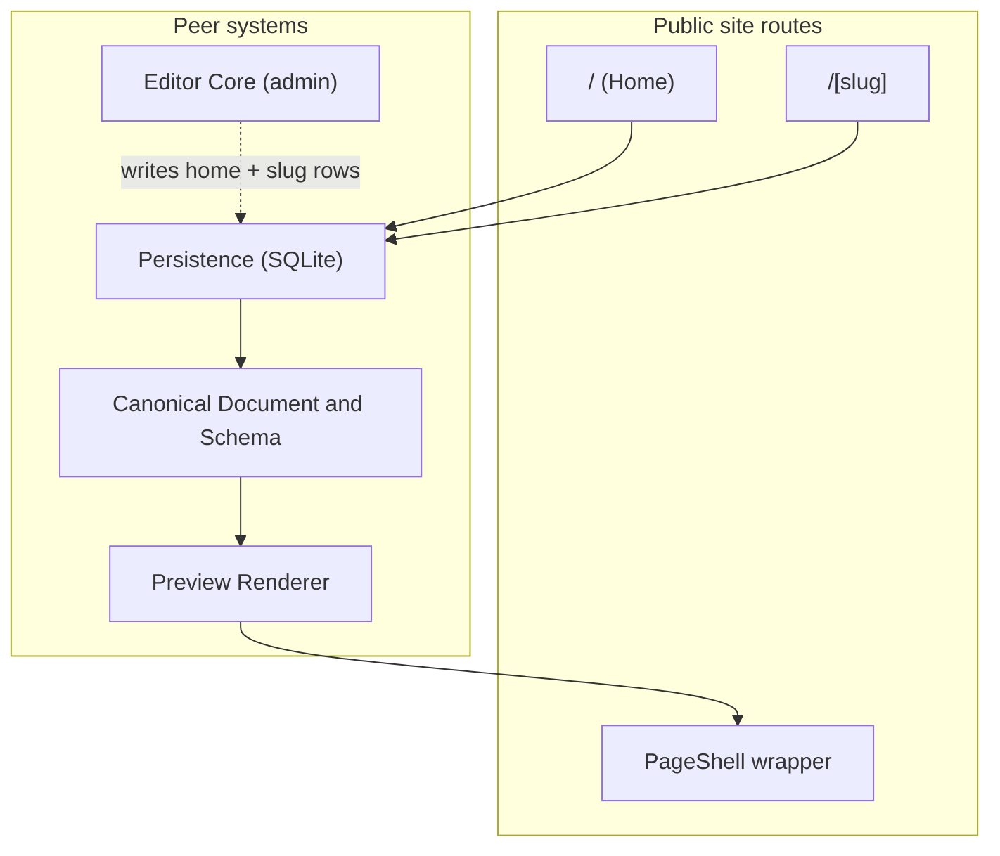

# Public Site

## 1. Component Overview

**Public Site** ist das **öffentlich auslieferbare Frontend** der OpenFrame-App: Server-Routen rendern persistierte `OpenframePageDocument`-Bäume direkt unter **`/[slug]`** (und unter **`/`** für die immer vorhandene **`home`**-Seite). Es ist die **WordPress-artige „Frontend“-Hälfte** zur **Studio-Hälfte unter `/admin/*`** (siehe **EditorCore.md**, **DraftPreview.md**) und nutzt unverändert die **Preview-Renderer-Pipeline** — ohne Editor-Chrome, ohne Draft-Bridges, ohne `postMessage`. Die Komponente lebt im **C4-Container „OpenFrame Web Application“** (Next.js Server Components, Node-Runtime).

## 2. Architecture Diagram (Mermaid)

**Kernfluss:** Server-Route → **`pageRepository.getPageBySlug(slug)`** → **`renderPageDocument`** (gewrappt in **`PageShell`**). Bei **`not_found`** zeigt **`/[slug]`** ein **`notFound()`**, **`/`** **seedet** beim ersten Aufruf die `home`-Seite aus **`getStarterPageDocument()`** und persistiert sie sofort, damit „immer eine Startseite definiert“ bleibt.

## 3. Public Interfaces (API)

Implementiert unter `src/app/page.tsx`, `src/app/[slug]/page.tsx`, `src/lib/preview/render-page-shell.tsx`.

| Funktion / Baustein | Zweck |
| ------------------- | ----- |
| **`/` (`src/app/page.tsx`)** | Server Component, lädt Slug **`home`**. Bei **`not_found`**: einmaliger **Auto-Seed** aus **`getStarterPageDocument()`** via **`pageRepository.upsertPageDocument`** und sofortige Anzeige. **`runtime: "nodejs"`**, **`dynamic: "force-dynamic"`**. |
| **`/[slug]` (`src/app/[slug]/page.tsx`)** | Server Component, validiert Slug mit **`isSafePageSlug`** (lehnt **reservierte** Slugs `admin`, `api`, `_next`, `preview`, `assets` ab — siehe `src/lib/persistence/slug.ts`). Bei **`not_found`** → **`notFound()`**; bei **`invalid_json` / `invalid_stored`** → Hinweispanel mit Link in den Editor. |
| **`PageShell`** in `src/lib/preview/render-page-shell.tsx` | Sitewide Wrapper um **`renderPageDocument`** für künftige Site-Chrome (Header/Footer, Motion-Shell). Aktuell nur `min-h-dvh bg-white`. |
| **`RESERVED_PAGE_SLUGS`** in `src/lib/persistence/slug.ts` | Quelle der Wahrheit für gesperrte Slugs; **`isSafePageSlug`** prüft case-insensitive. |

**Konventionen:**

- Public-Routen lesen **direkt** aus **`pageRepository`** (Node-Runtime), kein zusätzlicher REST-Hop, kein Client-State.
- Kein **Edit-/Studio-Chrome**: keine **`[data-editor-chrome]`**-Klassen, keine Editor-`postMessage`-Listener.
- Slug-Quelle ist die **DB** (SQLite); Datei-Sync und Multi-Site-Support sind nicht Teil des MVP.

## 4. Dependencies

| Abhängigkeit | Rolle |
| ------------ | ----- |
| **[Persistence](./Persistence.md)** | **`pageRepository.getPageBySlug`** und **`upsertPageDocument`** (Auto-Seed). |
| **[Canonical Document & Schema](./CanonicalDocumentSchema.md)** | Validierung beim Laden; **`getStarterPageDocument`** beim Seed. |
| **[Preview Renderer](./PreviewRenderer.md)** | **`renderPageDocument`** wird unverändert benutzt. |
| **Next.js App Router** | Dynamische Segmente, **`notFound`**, Server Components. |

**Nicht** im MVP: SEO-Metadaten je Seite, Sitemap/RSS, ISR/Revalidate-Strategien, Multi-Tenant.

## 5. Data Structures & State Management

- **Eingabe:** validiertes **`OpenframePageDocument`** aus SQLite.
- **State:** Stateless Server Components; jeder Request läuft unabhängig.
- **Auto-Seed:** Nur unter **`/`**, nur bei **`not_found`** für Slug `home`. Keine Auto-Erzeugung für beliebige `/[slug]`.

## 6. Known Limitations / Edge Cases

- **`isSafePageSlug` rejects framework slugs:** `/admin`, `/api`, `/_next` und `/preview` sind ohnehin durch Next.js-Static-Routen abgefangen; die Reservierungsliste ist eine zweite Verteidigungslinie und verhindert, dass über die API jemals ein Konfliktslug angelegt wird.
- **Auto-Seed nur einmal:** Wird die `home`-Seite manuell gelöscht (z. B. via SQL), erzeugt der nächste **`/`**-Request sie erneut aus dem Starter — bewusst, damit „leere Site“ kein Default ist.
- **Bad-Document-Panel:** Bei `invalid_stored` / `invalid_json` wird *kein* 500 ausgeliefert; der Editor-Link soll zur manuellen Reparatur führen.
- **SSR-only:** Blöcke mit Browser-only APIs müssen wie im Preview-Renderer als **Client Components** markiert werden.
- **Cache:** **`dynamic: "force-dynamic"`** verhindert Caching, damit **frische** Editor-Inhalte sofort sichtbar sind. Performance-Tuning (ISR/Revalidate) ist Post-MVP.

## 7. Testing & Verification

| Methode | Zweck |
| ------- | ----- |
| `pnpm test` | **`src/lib/persistence/slug.test.ts`** prüft reservierte Slugs; Renderer-Tests bleiben in **`render-page-document.test.tsx`**. |
| `pnpm dev` | **`/`** → Home (Auto-Seed bei leerer DB), **`/<slug>`** → persistierte Seite, **`/admin/editor?slug=<slug>`** zur Bearbeitung. |
| API | **`PUT /api/pages/<slug>`** → danach **`/<slug>`** im Browser refreshen. |

---

*Stand: Public-Routen `/` (home + Auto-Seed) und `/[slug]` als Server Components, gemeinsame `PageShell`; reservierte Slugs (admin, api, _next, preview, assets) in `isSafePageSlug`.*
